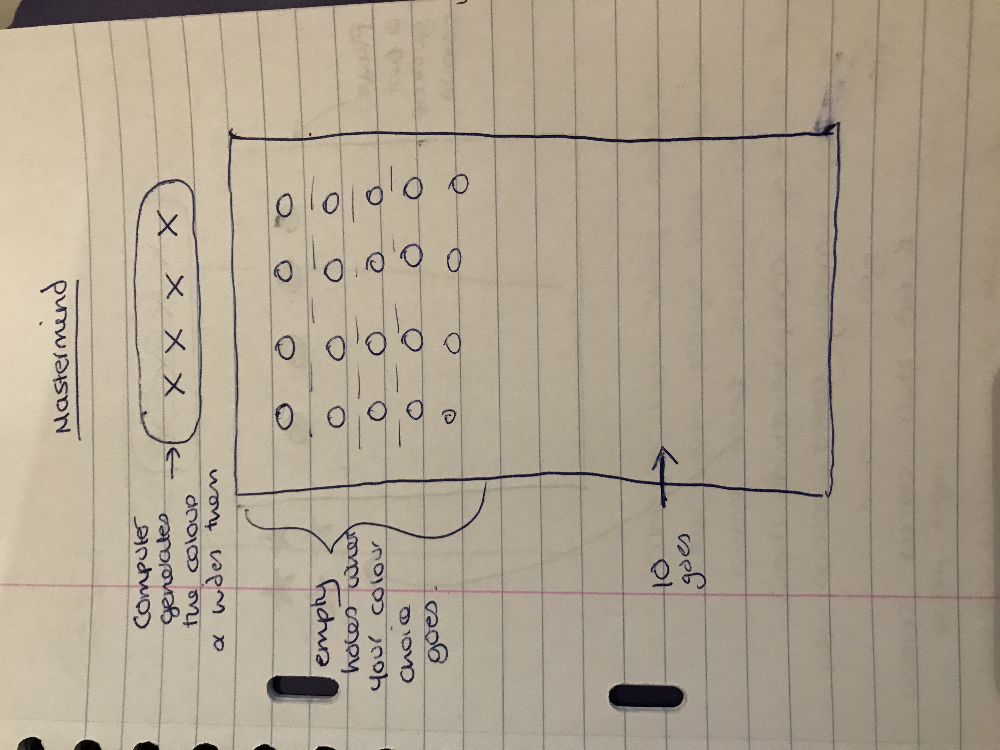
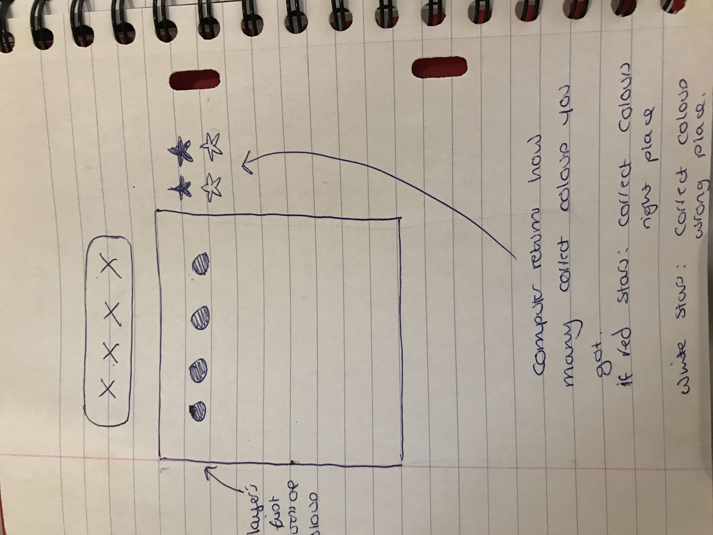

# sparta-project1-jsgame

## The game
* The game I have created is Mastermind.
* I chose this game as  I thought the process of understanding how to make mastermind would help me further my understanding of javascript and the logic behind it, which it did. It is also one of my favourite board games.

#### Instructions
1. To play the game you must start by clicking the 'click to begin' button in order to generate the computer sequence.
2. Then you can click on any four colours to begin decoding the computer sequence. After you have selected your colours you must click on the 'click to score' button in order to see the result of your guess.
3. If the computer returns red pins it means you have the correct colour in the correct positions. If it returns white pins you have the correct colour in the wrong position.
4. You win the game once you have got the correct colour sequence. If you reach the end of the 10th row and have not got the correct colour sequence, you lose.

## The Task

Your mission, should you choose to accept it! Is to build a **browser based game!** Your game should be built using html, css and JavaScript!

**The choice of game is totally up to you however before you get to work, you must ensure you have had your project idea approved by one of your trainers.**

Your game must:

* Include an instruction section explaining how to play the game.
* Ether display a message when the user has won or display the users score after the game has finished.
* Be styled to perfection!
* Be hosted online!

#### What I delivered:
* As a user I can see the mastermind board.
* As a user I can read the instructions.
* As a user I can start the game.
* As a user I can undo a turn.
* As a user I can look at a visually pleasing board.
* As a user I can tell when the computer sequence is generated.
* As a user I can access the coloured beads and they respond to my click.
* As a user I can press which slot the coloured beads will go into.
* As a user I can see the results of my sequence through the computer placing red or white tokens.
* As a user I can see the computer generated sequence at the end of the game and whether I have won.
* As a user I have the option to play again.
* As a user I can have a max of 10 goes.

#### What I am most pleased with
I am most pleased with the scoring system of the game. It works perfectly and the red/white pins look really good

#### What was the most challenging
Getting the scoring to understand duplicate colours and score them correctly. The first two times I tried fixing it the game would break half way through. The third time I finally got it working and haven't noticed any bugs with it as of yet. This is what I have submitted.

## Planning
For planning we used wireframes and a Trello board. This is the link to my trello board:
https://trello.com/b/FibWUgK0/mastermind.

These are my wireframe screenshots:

